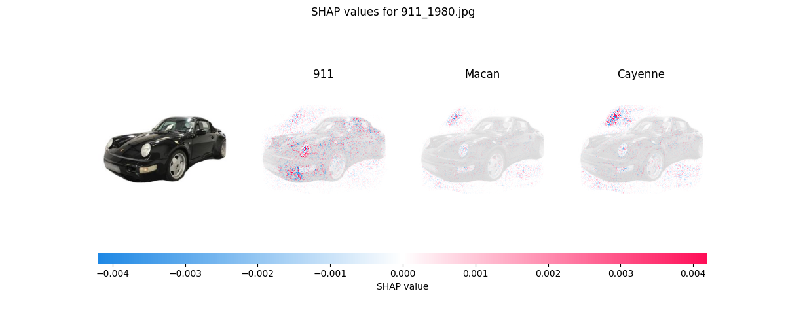
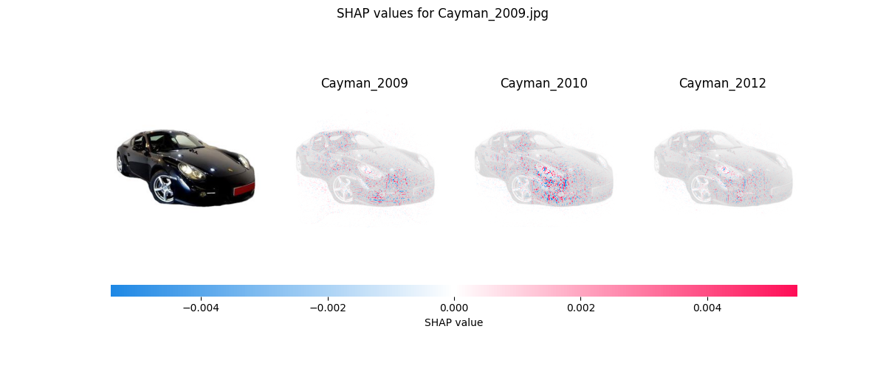
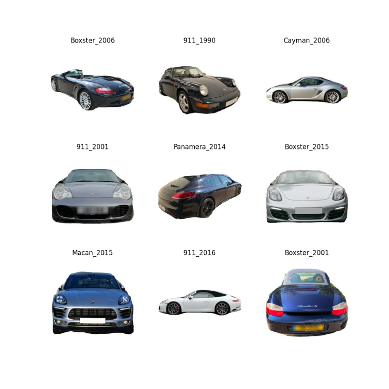

# PorscheInsight-CarClassification-AI
 
## Description
This repository contains a scripts to train models to classify pictures of Porsche cars.
It was a project for when I had free time. It is not ment to be used in production (yet).

## Future
The project is still in an early stage and I will add more models and features in the future.
### ToDo List
- [x] Add ONNX support
- [x] Implement better Testing
- [x] Implement shap for feature importance
- [ ] Add confusion matrix
- [ ] Evaluate feature engineering/ More data augmentation
- [ ] Try a deeper/wider or different pretrained model to improve accuracy on the more classes dataset
- [ ] Implement new Architecture: One model classifies the car type and another model classifies the year of the car
## Installation
Install tensorflow, keras and the other dependencies with pip:
```bash
pip install -m requirements.txt
```
## Models
The first version of the model was trained to predict 10 classes, which correspond to broad Porsche car model types. These classes include popular models such as the 911, Cayman, and Panamera, among others. The accuracy of this model on the training set was 99%, and the accuracy on the validation set was 95%.

After achieving satisfactory results with the 10-class model, a second model was trained to predict 88 classes, which correspond to specific Porsche car model variants and years. For example, this model can predict whether an image is a 911 from 2008 or a Cayenne from 1990. The accuracy of this model on the training set was 80%, and the accuracy on the validation set was 46%.

| Model                 | Total params | Trainable params | Non-trainable params | Accuracy Train % | Accuracy Val % | Number of classes |
|-----------------------|--------------|------------------|----------------------|------------------|----------------|-------------------|
| without augmentation* | 11,239,850   | 11,239,850       | 0                    | 98               | 78             | 10                |
| with augmentation*    | 11,239,850   | 11,239,850       | 0                    | 79               | 74             | 10                |
| old_pretrained*       | 20,027,082   | 5,311,114        | 14,715,968           | 74               | 72             | 10                |
| VGG16 pretrained*     | 20,027,082   | 12,390,538       | 7,636,544            | 99               | 95             | 10                |
| VGG16 pretrained      | 20,027,082   | 12,390,538       | 7,636,544            | 80               | 46             | 88                |
| Efficient(new head)   |              |                  |                      |                  |                |                   |

The models with * were trained on the pre cleaned dataset.

Have a look at the [models](models) folder to see the code and [results](models/car_types/results) folder to see the results.

## Usage
### Train a model
To train a model you can use the [train](training) folder. You can choose the model, the dataset and the number of epochs.

### Predict with a model (Inference)
To predict with a model you can use the [test_model.py](testing/test_model.py) script. You can choose the model and the image you want to predict.
I recommend to prepare the images with [prepare_images.oy](testing/prepare_images.py) before. Thus, an error-free and improved prediction is guaranteed.
### Explain a model
To explain a model you can use the [explainer.py](testing/shap/explainer.py) script. You can choose the model and the image(folder) you want to get explanations.
I recommend to prepare the images with [prepare_images.oy](testing/prepare_images.py) before.
### Sample images from my dataset


### Convert a model to ONNX
# Dataset
The dataset is from [Github](https://github.com/Flippchen/porsche-pictures) and contains ~32.000 pictures of potential Porsche cars.
Since the source of the dataset is public the quality and the arrangement of the images was also not great.
After the data was cleaned, there are ~30.300 pictures left. Several pictures were removed because they were not of a Porsche car or the picture was not clear enough.
Have a look at the data:
 

