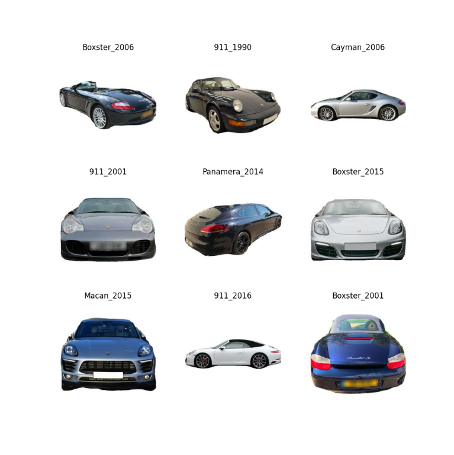

# PorscheInsight-CarClassification-AI
 
## Description
This repository contains a scripts to train models to classify pictures of Porsche cars.
It was a project for when I had free time. It is not ment to be used in production (yet).

## Future
The project is still in a early stage and I will add more models and features in the future.

## Installation
Install tensorflow and keras
```bash
pip install tensorflow
pip install keras
```
## Models
The first version of the model was trained to predict 10 classes. After the accuracy was good enough I started training a model to predict 100 classes.

| Model                 | Total params  | Trainable params  | Non-trainable params | Accuracy Train % | Accuracy Test % | Number of classes |
|-----------------------|---------------|-------------------|----------------------|------------------|-----------------|-------------------|
| without augmentation* | 11,239,850    | 11,239,850        | 0                    | 98               | 78              | 10                |
| with augmentation*    | 11,239,850    | 11,239,850        | 0                    | 79               | 74              | 10                |
| old_pretrained*       | 20,027,082    | 5,311,114         | 14,715,968           | 74               | 72              | 10                |
| VGG16 pretrained*     | 20,027,082    | 12,390,538        | 7,636,544            | 99               | 95              | 10                |
The models with * were trained on the pre cleaned dataset.

Have a look at the [models](models) folder to see the code and [results](models/few_classes/results) folder to see the results.
# Dataset
The dataset is from [Github](https://github.com/Flippchen/porsche-pictures) and contains ~32.000 pictures of potential Porsche cars.
Since the source of the dataset is public the quality and the arrangement of the images was also not great.
After the data was cleaned, there are ~30.300 pictures left. Several pictures were removed because they were not of a Porsche car or the picture was not clear enough.
Have a look at the data:
 