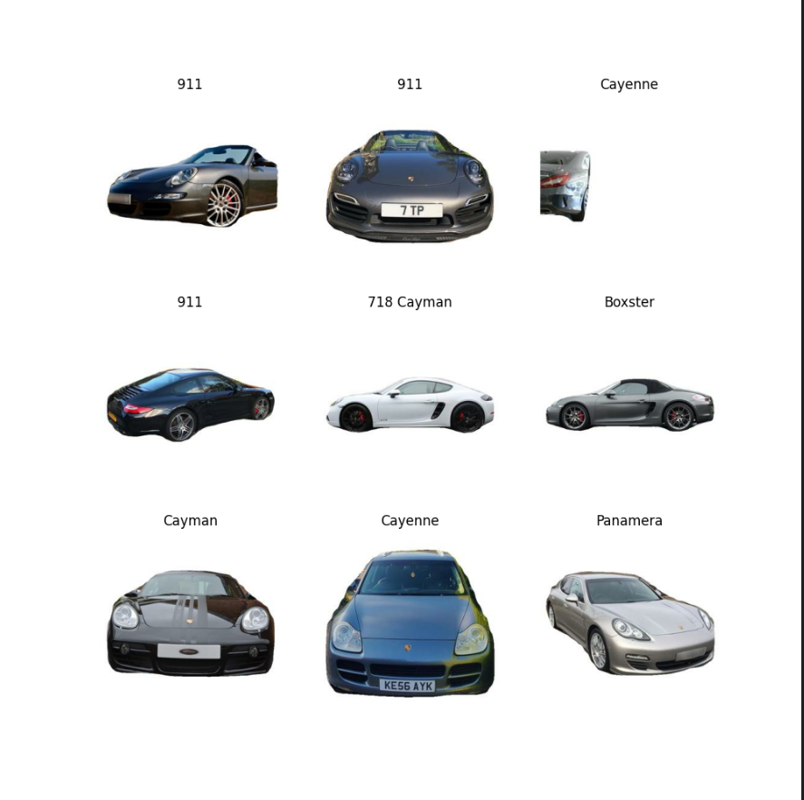

# PorscheInsight-CarClassification-AI
 
## Description
This repository contains a scripts to train models to classify pictures of Porsche cars.
It was a project for when I had free time. It is not ment to be used in production (yet).

## Future
The project is still in a early stage and I will add more models and features in the future.

## Installation
Install tensorflow and keras
```bash
pip install tensorflow
pip install keras
```
## Models
| Model                | Total params  | Trainable params  | Non-trainable params | Accuracy Train % | Accuracy Test % |
|----------------------|---------------|-------------------|----------------------|------------------|-----------------|
| without augmentation | 11,239,850    | 11,239,850        | 0                    | 98               | 78              |
| with augmentation    | 11,239,850    | 11,239,850        | 0                    | 79               | 74              |
| old_pretrained       | 20,027,082    | 5,311,114         | 14,715,968           | 74               | 72              |
| VGG16 pretrained     | 20,027,082    | 12,390,538        | 7,636,544            | 99               | 95              |
Have a look at the [models](models) folder to see the code and [results](results) folder to see the results.
# Dataset
The dataset is from [Github](https://github.com/Flippchen/porsche-pictures) and contains ~ 32.000 pictures of Porsche cars.
Have a look at the data:
 