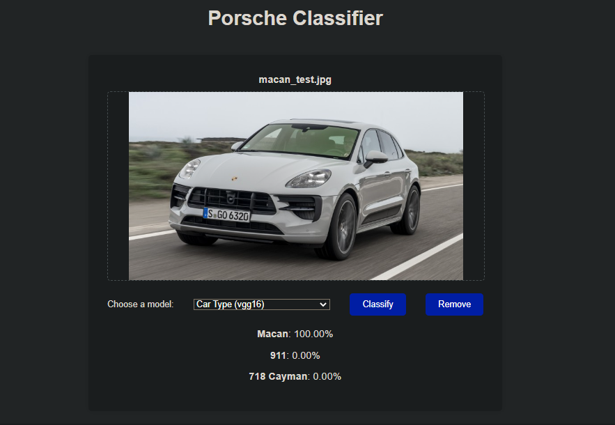
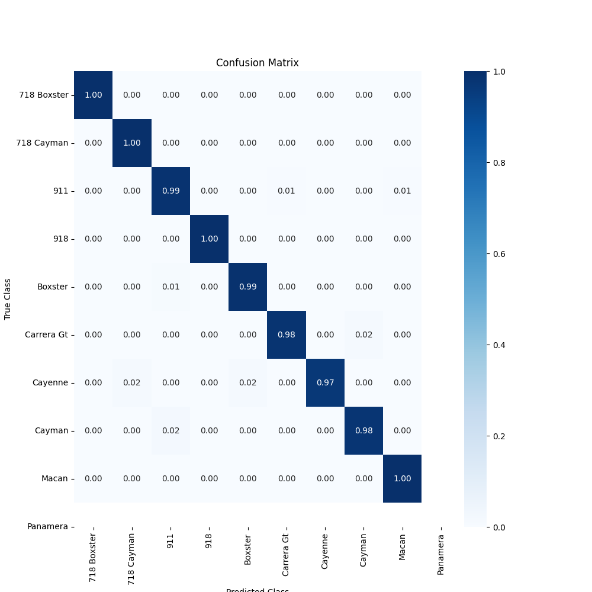
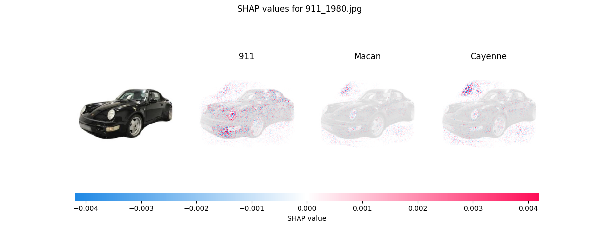
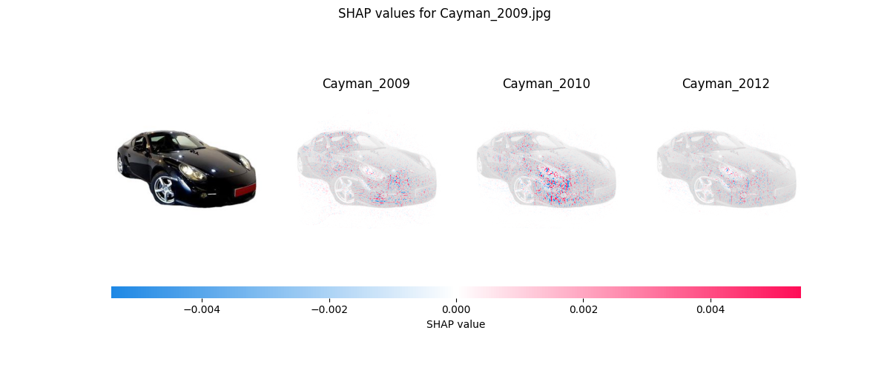

# PorscheInsight-CarClassification-AI
 
## Description
This repository contains a scripts to train models to classify pictures of Porsche cars.
It was a project for when I had free time. It is not ment to be used in production (yet).

## Future
The project is still in an early stage and I will add more models and features in the future. Maybe I will also add a (web) app to use the models.

## Web UI
The Web UI is a simple local website that enables users to upload images of Porsche cars and get classification results from the models. The app is built using Eel, which allows Python and HTML/JS to communicate with each other.
### Installation
```bash
pip install -m build_requirements.txt
```
### Usage
```bash
python web_app/main.py
```
or download it from [GitHub](https://github.com/Flippchen/PorscheInsight-CarClassification-AI/actions).
### Screenshot


### ToDos
- [ ] Train on cleaned classes with Vision Transformer
- [ ] Evaluate feature engineering/ More data augmentation
- [ ] Add Taycans to images/models
- [ ] Add django web app
- [ ] Implement new Architecture: One model classifies the car type and another model classifies the year of the car

<details>
<summary>Completed Tasks</summary>

- [x] Add ONNX export
- [x] Implement better Testing
- [x] Implement shap for feature importance
- [x] Add confusion matrix
- [x] Try a deeper/wider or different pretrained model to improve accuracy on the more classes dataset
- [x] Add a (web) app to use the models
- [X] Train on cleaned classes
- [x] Add onnx models to web UI to speedup and reduce size
- [x] Isnet model for bg remove
- [x] Bundle in one Binary
</details>


## Installation
Install tensorflow, keras and the other dependencies with pip:
```bash
pip install -m requirements.txt
```
## Models
The first version of the model was trained to predict 10 classes, which correspond to broad Porsche car model types. These classes include popular models such as the 911, Cayman, and Panamera, among others. The accuracy of this model on the training set was 99%, and the accuracy on the validation set was 95%.

After achieving satisfactory results with the 10-class model, a second model was trained to predict 88 classes, which correspond to specific Porsche build years. For example, this model can predict whether an image is a 911 from 2008. The accuracy of this model on the training set was 80%, and the accuracy on the validation set was 46%.

For the third model I bundled several years together to imitate the Porsche car series like the 911 991 or 911 992. The model was trained to predict 30 classes, the accuracy on the validation set was 85%.

| Model                                 | Total params | Trainable params | Non-trainable params  | Batch size | Accuracy Train % | Accuracy Val % | Number of classes |
|---------------------------------------|--------------|------------------|-----------------------|------------|------------------|----------------|-------------------|
| without augmentation*                 | 11,239,850   | 11,239,850       | 0                     | 32         | 98               | 78             | 10                |
| with augmentation*                    | 11,239,850   | 11,239,850       | 0                     | 32         | 79               | 74             | 10                |
| old_pretrained*                       | 20,027,082   | 5,311,114        | 14,715,968            | 32         | 74               | 72             | 10                |
| VGG16 pretrained*                     | 20,027,082   | 12,390,538       | 7,636,544             | 32         | 99               | 95             | 10                |
| VGG16 pretrained                      | 20,027,082   | 12,390,538       | 7,636,544             | 32         | 80               | 46             | 88                |
| efficientnetv2-b1(new head & faster)  | 7,106,956    | 993,416          | 6,113,640             | 32         | 47               | 46             | 88                |
| efficientnetv2-b1                     | 23,332,236   | 17,216,136       | 6,116,100             | 32         | 49               | 46             | 88                |
| efficientnetv2-b1 (cleaned classes)   | 23,332,236   | 17,216,136       | 6,116,100             | 32         | 82               | 85             | 30                |

The models with * were trained on the pre cleaned dataset.

Have a look at the [releases](https://github.com/Flippchen/PorscheInsight-CarClassification-AI/releases) to see the models and [results](models/car_types/results) folder to see the results.

## Usage
### Train a model
To train a model you can use the [train](training) folder. You can choose the model, the dataset and the number of epochs.
You can use the build in Discord Callback to get notfications on Discord after every epoch. You need to change the discord webhook url in the training file.
### Predict with a model (Inference)
To predict with a model you can use the [test_tf_model.py](testing/test_tf_model.py) script. You can choose the model and the image you want to predict.
If you want to predict with an onnx model you can use the [test_onnx_model.py](testing/test_onnx_model.py) script.

I recommend to prepare the images with [prepare_images.py](testing/prepare_images.py) before. Thus, an error-free and improved prediction is guaranteed.
### Explain a model
To explain a model you can use the [explainer.py](metrics_insights/shap/explainer.py) script. You can choose the model and the image(folder) you want to get explanations.
I recommend to prepare the images with [prepare_images.py](testing/prepare_images.py) before.

After using shap values on the new efficientnet model and the vgg16 model, both on the old head, I found out that the vgg16 model found "better" spots to distinguish between classes, at least sometimes.

### Confusion matrix of a model
The confusion matrix shows the performance of a classification model. It shows the number of correct and incorrect predictions made by a classifier.

To get a confusion matrix of a model you can use the [confusion_matrix.py](metrics_insights/confusion_matrix/confusion_matrix.py) script. You can choose the model and the test set you want to get the confusion matrix from.
<details>
<summary><b>Confusion Matrix</b></summary>



</details>

The confusion matrix of the specific model variants is too big to show it here. You can find it in the [results](metrics_insights/confusion_matrix/results) folder.

### Sample images from the shap values
<details>
<summary><b>Explained images</b></summary>




</details>


### Convert a model to ONNX
You can use the [convert_to_onnx.py](models/export_to_onnx.py) script to convert a keras(.h5) model to ONNX. You can choose the model you want to convert and a save path.
# Dataset
The dataset is from [Github](https://github.com/Flippchen/porsche-pictures) and contains ~32.000 pictures of potential Porsche cars.
Since the source of the dataset is public the quality and the arrangement of the images was also not great.
After the data was cleaned, there are ~30.300 pictures left. Several pictures were removed because they were not of a Porsche car or the picture was not clear enough.

<details>
<summary><b>Have a look at the data:</b></summary>


</details>
