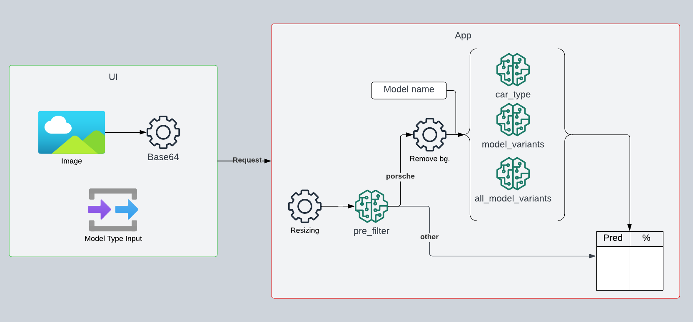

# PorscheInsight-CarClassification-AI

 
 
 


## Description

This repository contains scripts to train models to classify pictures of Porsche cars.
Check out the PowerPoint presentation [here](assets/Porsche_AI_classifier.pptx).

The following different model types are available:

| 🚗 Model       | 📝 Description                                                                                                                                                                                                                                                                                                                                                 |
|----------------|----------------------------------------------------------------------------------------------------------------------------------------------------------------------------------------------------------------------------------------------------------------------------------------------------------------------------------------------------------------|
| pre_filter     | This model is responsible for identifying whether an image contains a Porsche car or not. It is the first step in the classification process, and if the model determines the image to be a Porsche, it proceeds to the next models for further classification.The model is used for the new architecture in the [web_ui](web_ui).                             |
| model type     | This model predicts 10 broad Porsche car model types, such as 911, Cayman, and Panamera, among others. It is the second step in the classification process and helps to categorize the cars based on popular models.                                                                                                                                           | 
| car series     | Trained to predict 30 classes, this model groups several years together to imitate Porsche car series like the 911 991 or 911 992. It is a more detailed classification that focuses on car series rather than specific years.                                                                                                                                 |
| all car series | This model classifies images into 88 classes, corresponding to specific Porsche build years. It is the most detailed classification level, predicting not only the car model type but also the specific build year, e.g., a 911 from 2008. This model is suitable for users who want to identify and classify Porsche cars down to the finest level of detail. |

## Web UI
<a href='https://play.google.com/store/apps/details?id=com.flippchen.porsche_classifier'>
  
</a>

The Web UI is a simple local website that enables users to upload images of Porsche cars and get classification results from the models. The app is built using Eel, which allows Python and HTML/JS to
communicate with each other.
For a free online version of the Web UI, check out [PorscheInsight](https://classify.autos).

With the Web UI, non-car images tend to lead to more random predictions. I trained a model to classify Porsche, other car brands, and others, resulting in a two-step [Web UI](web_ui) architecture for Porsche
Identification and Classification.

### Installation

```bash
pip install -m build_requirements.txt
```

### Usage

```bash
python web_app/main.py
```

or download the [executable](https://github.com/Flippchen/PorscheInsight-CarClassification-AI/actions).

### Demo


### Architecture

The Web UI employs a two-step process involving two models. Initially, the pre_filter model determines if an image contains a Porsche. If a Porsche is detected, the image proceeds to the second model,
which classifies the car according to the user's input.


To see the architecture of the Local App UI, click the arrow below.
<details>
<summary>App UI</summary>

</details>

### Experimental Ensemble Models 🧪
To improve accuracy and prediction capabilities, I have experimented with two ensemble models. Ensemble models combine predictions from multiple models to give a final verdict, which often results in better prediction accuracy. These ensemble models are still in the experimental phase and can be found in the [ensemble](web_ui/main_ensemble.py).

1. Car Type Ensemble Model (weighted average)
    - Description: Trained two models on the same objective. Each with its on strengths and weaknesses. The results get weighted (correct weights through intensive testing). The models also differ in model architecture. 
    - Achievements:
      - More balanced predictions
      - Better prediction accuracy
2. Car Type hierarchy with car series (specific car type) (weighted average)
    - Description: Created a hierachy of models. The first models predicts the car type. The second model predicts the car series. After this the results get aligned with the car type model.
    - Achievements:
      - much less outlier predictions
      - better prediction accuracy
      


### ToDos

- [ ] Experiment with EfficientNet-Lite4
- [ ] Retrain all models with better dataset
- [ ] Switch to Google Cloud function/use S3 bucket/compress image
- [ ] Improve pre_filter model/Use Grounded SAM
- [ ] Add Taycans to images/models

<details>
<summary>Completed Tasks</summary>

- [x] Add ONNX export
- [x] Implement better Testing
- [x] Implement shap for feature importance
- [x] Add confusion matrix
- [x] Try a deeper/wider or different pretrained model to improve accuracy on the more classes dataset
- [x] Add a (web) app to use the models
- [X] Train on cleaned classes
- [x] Add onnx models to web UI to speedup and reduce size
- [x] Isnet model for bg remove
- [x] Bundle in one Binary
- [x] Add django web app
- [x] Train on cleaned classes with Vision Transformer
- [x] Add Android App
- [x] Implement new Architecture: One model classifies if a car is present and a second model classifies the car
- [x] Implement new architecture to online version
- [x] Add release 1.0.0
- [x] Add docker support (AWS Lambda)
- [x] Display the mask of the predicted car
- [x] Retrain car type model with efficientnet model
- [x] Build an ensemble prediction
- [X] Train a meta-learner
- [x] Try autokeras
- [x] Improve model predictions overall
- [x] Evaluate feature engineering/ More data augmentation
- [x] Build an ensemble model with car_type and car_series

</details>

## Installation

### Requirements

- Python >3.8, <3.11
- [optional] CUDA 11.1
- [optional] cuDNN 8.0.5

Install tensorflow, keras and the other dependencies with pip:

```bash
pip install -m requirements.txt
```

## Models

| Model                                | Total params | Trainable params | Non-trainable params | Batch size | Accuracy Train % | Accuracy Val % | Number of classes |
|--------------------------------------|--------------|------------------|----------------------|------------|------------------|----------------|-------------------|
| VGG16 pretrained*                    | 20,027,082   | 12,390,538       | 7,636,544            | 32         | 99               | 95             | 10                |
| efficientnetv2-b1(new head & faster) | 7,106,956    | 993,416          | 6,113,640            | 32         | 47               | 46             | 88                |
| efficientnetv2-b1 (cleaned classes)  | 7,099,474    | 985,934          | 6,113,540            | 32         | 82               | 85             | 30                |
| efficientnetv2-b1-pre-filter         | 7,095,991    | 982,451          | 6,113,540            | 32         | 98               | 99             | 3                 |

<details><summary>Open to view older models</summary>

| Model                                   | Total params | Trainable params | Non-trainable params | Batch size | Accuracy Train % | Accuracy Val % | Number of classes |
|-----------------------------------------|--------------|------------------|----------------------|------------|------------------|----------------|-------------------|
| without augmentation*                   | 11,239,850   | 11,239,850       | 0                    | 32         | 98               | 78             | 10                |
| with augmentation*                      | 11,239,850   | 11,239,850       | 0                    | 32         | 79               | 74             | 10                |
| old_pretrained*                         | 20,027,082   | 5,311,114        | 14,715,968           | 32         | 74               | 72             | 10                |
| VGG16 pretrained                        | 20,027,082   | 12,390,538       | 7,636,544            | 32         | 80               | 46             | 88                |
| efficientnetv2-b1                       | 7,099,474    | 1985,934         | 6,113,540            | 32         | 49               | 46             | 88                |
| vit_b16 (cleaned classes)               | 85,901,470   | 102,558          | 85,798,912           | 32         | 45               | 49             | 30                |
| efficientnetv2-b1-pre-filter-refactored | 7,095,991    | 982,451          | 6,113,540            | 32         | 97               | 98             | 3                 |
| efficientnetv2-b1-car-type              | 7,096,894    | 1,329,386        | 5,767,508            | 32         | 96               | 97             | 10                |

</details>

The models with * were trained on the pre cleaned dataset.

Have a look at the [releases](https://github.com/Flippchen/PorscheInsight-CarClassification-AI/releases) to see the models and [results](models/car_types/results) folder to see the training results.
You can have a look at the models structure with [Netron](https://netron.app/) or look at the [model_structure](assets/model_structure_visualizations) folder to see the model insights.

<details><summary>Have a look at an example</summary>

</details>

## Usage

### Train a model

To train a model you can use the [train](training) folder. You can choose the model, the dataset and the number of epochs.
You can use the build in Discord Callback to get notfications on Discord after every epoch. You need to change the discord webhook url in the training file.

### Predict with a model (Inference)

To predict with a model you can use the [test_tf_model.py](predicting/predict_tf_model.py) script. You can choose the model and the image you want to predict.
If you want to predict with an onnx model you can use the [test_onnx_model.py](predicting/predict_onnx_model.py) script.

I recommend to prepare the images with [prepare_images.py](utilities/prepare_images.py) before. Thus, an error-free and improved prediction is guaranteed.

### Explain a model

To explain a model you can use the [explainer.py](model_insights/shap/explainer.py) script. You can choose the model and the image(folder) you want to get explanations.
I recommend to prepare the images with [prepare_images.py](utilities/prepare_images.py) before.

After using shap values on the new efficientnet model and the vgg16 model, both on the old head, I found out that the vgg16 model found "better" spots to distinguish between classes, at least
sometimes.

### Confusion matrix of a model

The confusion matrix shows the performance of a classification model. It shows the number of correct and incorrect predictions made by a classifier.

To get a confusion matrix of a model you can use the [confusion_matrix.py](model_insights/confusion_matrix/confusion_matrix.py) script. You can choose the model and the test set you want to get the
confusion matrix from.
<details>
<summary><b>Confusion Matrix</b></summary>


</details>

The confusion matrix of the specific model variants is too big to show it here. You can find it in the [results](model_insights/confusion_matrix/results) folder.

### Sample images from the shap values

<details>
<summary><b>Explained images</b></summary>


</details>

### Convert a model to ONNX

You can use the [convert_to_onnx.py](models/export_to_onnx.py) script to convert a keras(.h5) model to ONNX. You can choose the model you want to convert and a save path.

# Dataset

The dataset is from [Github](https://github.com/Flippchen/porsche-pictures) and contains ~32.000 pictures of potential Porsche cars.
Since the source of the dataset is public the quality and the arrangement of the images was also not great.
After the data was cleaned, there are ~30.300 pictures left. Several pictures were removed because they were not of a Porsche car or the picture was not clear enough.

<details>
<summary><b>Have a look at the data:</b></summary>


</details>

For the training of the <b>pre_filter</b> model a mixture of the [porsche-pictures](https://github.com/Flippchen/porsche-pictures) dataset, other Open Source datasets
like [cifar-10](https://www.cs.toronto.edu/~kriz/cifar.html) were used.

# Disclaimer

<b>This is not an official Porsche product and is not affiliated with or endorsed by Porsche AG</b>

<a href='assets/classify_qr_code.png'>
   
</a>